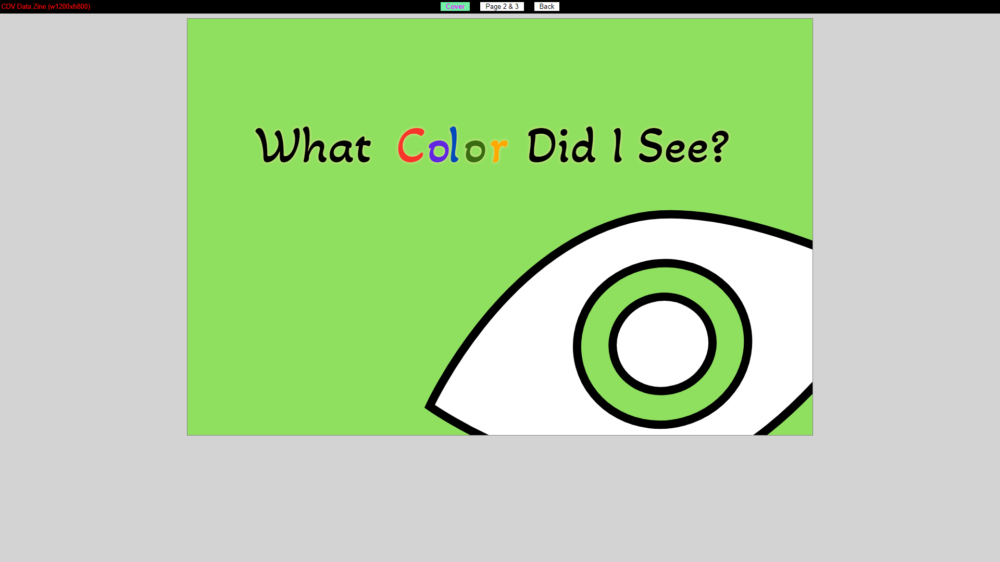

## Project (Data Zine)

# Screenshots

# Link

See my work [here](https://tomzhu1024.github.io/cdv-student/projects/datazine/cover.html).

# Questions and Answers

## What data did you choose to collect?

The data I chose to record are the colors that my eyes capture throughout the day, along with some ancillary information, such as the time of day, where the color came from, etc.

## How did you collect it, was it the routine?

Initially, my idea was to set an alarm that goes off every hour, and whenever the alarm goes off I immediately record the color of the object I see at that time. However, I soon found this approach not feasible. So, my actual process of data collecting was based on my time estimation and memory. Approximately each hour, I will record the color I see and the object the color comes from on the mobile phone's memo app. Sometimes, I may forget to do this routine, then I will use my memory to fill the missing data.

## Why did you choose to visualize the data in this way?

Since my data points are evenly distributed through the timescale of one day, with an interval of one hour, I got my inspiration from the idea of clock, which also uses a different angle to illustrate different time; when I built the pattern of the frequency of appearance of colors, I was inspired by a music visualization pattern that displays the audio spectrum along a circular path.

## What can be seen in the visualization? Does it reveal something you didn't expect?

In the visualization, it can be seen what color I see every hour and where the color comes from. From these two information, I am able to recall the activity I was doing at that time, and other people might as well being able to guess the activity I was doing. What was outside my expectation is how much time I spent on screens (computers and mobile phones). From the visualization, it can be seen that most of the days I will spend lots of continuous hours on screens. It surprises me to see my real life style.

## Did you make crucial compromises? Which ones?

One of the compromise I made is that I preserved the text of the color source. I attempted to turn all these texts into non-text patterns. However, since there are so many of them, changing them into non-text patterns might leads to confusing visualization and messy legends. Therefore, I chose to preserve the text. (Perhaps the data collecting and data pre-processing process could be improved.)

## If this project had a larger scale and wasn't designed for print, how would you imagine it to be?

If this project had a larger scale and was not designed for printing, I think one of the major differences is that there will be more types of visualizations. More types of visualizations allows us to view data from more diverse angle. Moreover, I think there will be more animations, if the project was not designed for paper but screens. More animation not only makes the visualization more attracting but also allows further kinds of interaction.

